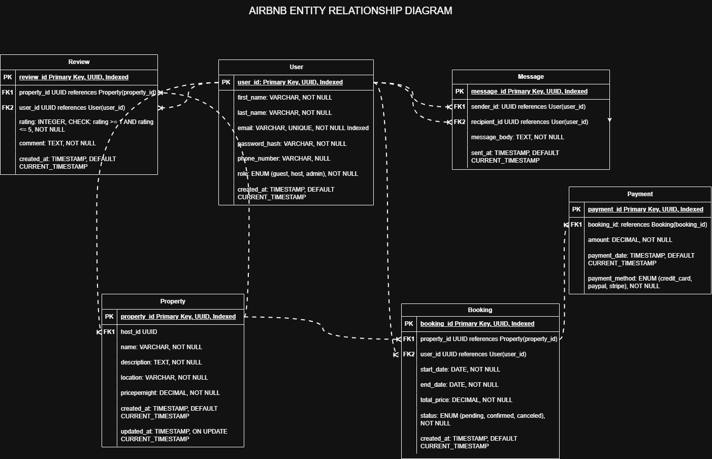

# Airbnb Clone – ERD Requirements

This document outlines the requirements and database specification used to create the Entity-Relationship Diagram (ERD) for the Airbnb Clone project.

## 📦 Entities and Attributes

### 1. User
- `user_id` (Primary Key, UUID)
- `first_name` (VARCHAR, NOT NULL)
- `last_name` (VARCHAR, NOT NULL)
- `email` (VARCHAR, UNIQUE, NOT NULL)
- `password_hash` (VARCHAR, NOT NULL)
- `phone_number` (VARCHAR, NULL)
- `role` (ENUM: guest, host, admin)
- `created_at` (TIMESTAMP, default current time)

### 2. Property
- `property_id` (Primary Key, UUID)
- `host_id` (Foreign Key → User.user_id)
- `name` (VARCHAR, NOT NULL)
- `description` (TEXT, NOT NULL)
- `location` (VARCHAR, NOT NULL)
- `price_per_night` (DECIMAL, NOT NULL)
- `created_at`, `updated_at` (TIMESTAMP)

### 3. Booking
- `booking_id` (Primary Key, UUID)
- `property_id` (Foreign Key → Property.property_id)
- `user_id` (Foreign Key → User.user_id)
- `start_date` (DATE, NOT NULL)
- `end_date` (DATE, NOT NULL)
- `total_price` (DECIMAL, NOT NULL)
- `status` (ENUM: pending, confirmed, canceled)
- `created_at` (TIMESTAMP)

### 4. Payment
- `payment_id` (Primary Key, UUID)
- `booking_id` (Foreign Key → Booking.booking_id)
- `amount` (DECIMAL, NOT NULL)
- `payment_date` (TIMESTAMP, default current time)
- `payment_method` (ENUM: credit_card, paypal, stripe)
- `payment_status` (ENUM: pending, completed, failed)

### 5. Review
- `review_id` (Primary Key, UUID)
- `property_id` (Foreign Key → Property.property_id)
- `user_id` (Foreign Key → User.user_id)
- `rating` (INTEGER, CHECK rating between 1 and 5)
- `comment` (TEXT, optional)
- `created_at` (TIMESTAMP)

### 6. Message
- `message_id` (Primary Key, UUID)
- `sender_id` (Foreign Key → User.user_id)
- `recipient_id` (Foreign Key → User.user_id)
- `message_body` (TEXT, NOT NULL)
- `sent_at` (TIMESTAMP)

---

## 📊 Database Schema Overview

| Entity    | Attribute           | Type                  | Description                               |
|-----------|---------------------|-----------------------|-------------------------------------------|
| **User**  | user_id             | UUID (PK)             | Unique identifier for each user           |
|           | first_name          | VARCHAR, NOT NULL     | User's first name                         |
|           | last_name           | VARCHAR, NOT NULL     | User's last name                          |
|           | email               | VARCHAR, UNIQUE       | User's email address                      |
|           | password_hash       | VARCHAR, NOT NULL     | Hashed password                           |
|           | phone_number        | VARCHAR               | Optional phone number                     |
|           | role                | ENUM (guest, host, admin) | Role of the user                       |
|           | created_at          | TIMESTAMP             | Timestamp of account creation             |

| Entity    | Attribute           | Type                  | Description                               |
|-----------|---------------------|-----------------------|-------------------------------------------|
| **Property** | property_id       | UUID (PK)             | Unique property ID                        |
|           | host_id             | UUID (FK to User)     | User who owns the property                |
|           | name              | VARCHAR, NOT NULL     | Property title                            |
|           | description         | TEXT, NOT NULL        | Property description                      |
|           | location            | VARCHAR, NOT NULL     | City or area where the property is        |
|           | price_per_night     | DECIMAL, NOT NULL     | Price per night                           |
|           | created_at          | TIMESTAMP             | Created date                              |
|           | updated_at          | TIMESTAMP             | Last updated date                         |

| Entity    | Attribute           | Type                  | Description                               |
|-----------|---------------------|-----------------------|-------------------------------------------|
| **Booking** | booking_id        | UUID (PK)             | Unique booking ID                         |
|           | property_id         | UUID (FK)             | Booked property                           |
|           | user_id            | UUID (FK to User)     | User who made the booking                 |
|           | start_date          | DATE, NOT NULL        | Check-in date                             |
|           | end_date            | DATE, NOT NULL        | Check-out date                            |
|           | total_price         | DECIMAL, NOT NULL     | Total cost                                |
|           | status              | ENUM (pending, confirmed, canceled) | Booking status     |
|           | created_at          | TIMESTAMP             | Timestamp of booking creation             |

| Entity    | Attribute           | Type                  | Description                               |
|-----------|---------------------|-----------------------|-------------------------------------------|
| **Payment** | payment_id        | UUID (PK)             | Unique payment ID                         |
|           | booking_id          | UUID (FK)             | Related booking                           |
|           | amount              | DECIMAL, NOT NULL     | Amount paid                               |
|           | payment_status      | ENUM (pending, completed, failed) | Status of payment     |
|           | payment_method      | ENUM (credit_card, paypal, stripe) | Method used    |
|           | payment_date        | TIMESTAMP             | When payment occurred                     |

| Entity    | Attribute           | Type                  | Description                               |
|-----------|---------------------|-----------------------|-------------------------------------------|
| **Review**  | review_id         | UUID (PK)             | Unique review ID                          |
|           | property_id          | UUID (FK)             | Associated property                        |
|           | user_id          | UUID (FK)             | Associated user                       |
|           | rating              | INTEGER (1-5)         | Rating score                              |
|           | comment             | TEXT                  | Optional comment                          |
|           | created_at          | TIMESTAMP             | Review timestamp                          |

| Entity    | Attribute           | Type                  | Description                               |
|-----------|---------------------|-----------------------|-------------------------------------------|
| **Message** | message_id        | UUID (PK)             | Unique message ID                         |
|           | sender_id           | UUID (FK to User)     | Sender of the message                     |
|           | recipient_id        | UUID (FK to User)     | Recipient of the message                  |
|           | message_body        | TEXT, NOT NULL        | Content of the message                    |
|           | sent_at             | TIMESTAMP             | Time sent                                 |

---

## 🔗 Relationships

- A **User** can have many **Properties** (1:N)
- A **User** can book many **Properties** via **Bookings** (1:N)
- A **Property** can have many **Bookings** (1:N)
- A **Booking** has one **Payment** (1:1)
- A **Property** has many **Reviews** (1:N)
- A **User** can send/receive many **Messages** (1:N in both directions)

---

## 🧩 ER Diagram

---

## 📁 ERD Location

- File: [AirBnB](https://drive.google.com/file/d/1CzCg7jbalz-MGzYQCjVV7aMRGzsFwtf7/view?usp=sharing)
- Tool Used: Draw.io / Diagrams.net

---

## ✅ Notes

- All UUIDs are used for primary and foreign keys for better scalability and uniqueness.
- Timestamps are used for tracking record creation and updates.
- Enums are used for predefined roles, booking/payment status, and payment methods.
- All relationships are represented in the ER diagram using appropriate cardinalities (1:1, 1:N).

